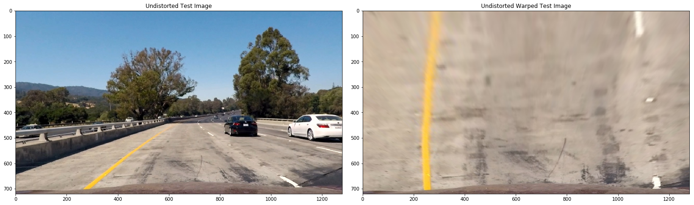
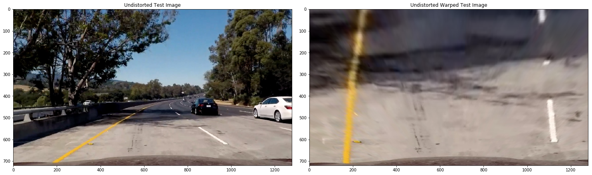

# UDACITY SDCND Project4:  Advanced Lane Finding


In this project of Advance Lane Finding, I have considered follwoing points: 

1> Camera Calibration

2> Distortion Correction

3> Binary Threshold 

4> Perspective Transform

With these, I tried to find the lanes of different colors and identified the vehicle path under various conditions.

Here camera has been calibrated with the given chesboard calibration image and test images have been used for developing the pipeline.
Images during each steps have been stored at the output_images file. It consists of few images for the camera calibration, test image undistortion, birds eye images and binary threshold images.


# Camera Calibration and Distortion Correction

As the first step, idea was to remove any kind of disortion of the image. 
Chess board images has been downloaded from Udacity. 


With the help of given chesboard images, we have calibrated the camera and identified calibration matrix and distortion coefficient. 

Using these calibartion matrix and distortion coefiicient we have defined the function, which converts test images into undistorted images. 


# Distortion correction of test images


# Perspective Transform

Here undistorted images have been transformed, so that it can be effectively viewed from different directions. Since left and right curves can be misjudged as having different curve radius or as if they are not parallel, while viewing from different angles.

Here a warp function has been defined, which takes undistorted image as input and converts it into warped image, which gives a birds eye view perspective of the lane.





# Binary Threshoulds

Once the warped images are generated, it is used for generating binary image of the lane. Since these images are having many details which are not important for the vehicle to drive, it was needed to be removed. And there are important details, like lane colors, which are needed to be highlighted.

There are several methods to use for this purpose. 

Since I was unable to higlight the yellow and white lines simultaneously with any single methods. I used multiple threshould to get the desired result on the test images. 

WHile using S channel from HLS color space, though it was highlighting the lane lines properly in most of the test images, in sme test images it was getting distorted.
Using Lab color space, its B color channel has done a decent job for yellow lane but was not effective for the white lane.
Similarly, L channel of LUV color space is good for whilte lane lines but not efficient for yellow lane lines. 

To create a satisfactory output, all above color channel thresholds have been combined and tested on the undistorted test images. 


# Lane image processing and vehicle positioning

AFter getting binary threshold image, now we need to process the image to get the driving path for the vehicle. For this we need to do a poylnomial curve fit on the lane lines. After this we can identify the driving path of the vehicle by filling the space between lanes. 

Also, apart from polynomial fit, vehicle position on the track need to be established. Lane lines are identified by the histogram peaks. To fit lane lines second order equation has been used.

At the end this step we are able to define the driving lane lines, driving area, lane curvature and vehicle position with respect to the center.


# Lane line characteristics

At this stage almost all the lane detection code is prepared. Now to use it for the video, first we are defining a class to store all the lane line attributes. Here we will be using several functions, which are going to be used to detect each lane pixels.

# Video Processing

In this pipeline, a function is defined which takes video input and gives processed video as output. Input video image is used from the udacity repository. Output video gives the information of the lane curves and vehicle position with respect to the driving lane center, apart from lane line poly-fit and driving area shadding.


# Conclusion

For the project video this code is running fine. Though for slightly difficult chllaging video, this is not tracing the path correctly. There are distortion happening in the lane tracing, specially in shadow condition. 

I believe this can be improved by using better color and gradient threshold. There are so many methods and parameters available, which needs to be analyzed for the optimum solution.

There are several limitations in this current code to make it suitable for most of real time driving scenario:

> Multiple lines on some crossings

> Zebra crossings in between

> Bad weather

> Water/ice on road

> Vehicle in the front

> Bad traffic condition etc

All these conditions needs extra training of the model and using mix of several algorithm and methods. 


```python

```
